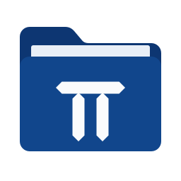

**Pi-Dimension 앱** — [Pi Image (이미지·만화 뷰어)](https://github.com/cherub8128/Pi-Image-Releases) · [Pi Player (동영상·음악 플레이어)](https://github.com/cherub8128/Pi-Player-Releases) · [Pi Zip (압축)](https://github.com/cherub8128/Pi-Zip-release) · [Pi PDF (PDF 편집)](https://github.com/cherub8128/Pi-PDF-releases)

# Pi Zip

더 작게 묶고, 어떤 압축 파일이든 안전하게 푸세요. 자체 코덱으로 7-Zip보다 작게 압축합니다. 개인·교육·업무용으로 무료입니다.

**[최신 버전 내려받기](https://github.com/cherub8128/Pi-Zip-release/releases/latest)** · [Pi-Dimension](https://pi-dimension.com/)

이 저장소는 **설치 파일 배포용**입니다. 소스 코드는 공개하지 않습니다.

## 어떤 파일을 받으면 되나요?

| 기기 | 선택할 파일 |
| --- | --- |
| Windows 10·11 (Intel·AMD 64비트) | `windows-x64-setup.exe` 권장 · MSI가 필요하면 `windows-x64.msi` · 설치 없이 쓰려면 `windows-x64-portable.exe` |
| Mac (Apple Silicon·Intel 모두) | `mac-universal.dmg` (또는 `mac-universal-adhoc.zip`) |
| Ubuntu·Debian·Mint 등 64비트 | `linux-x64.deb` |
| Fedora·RHEL·openSUSE 등 64비트 | `linux-x64.rpm` |
| 그 밖의 Linux 64비트 | `linux-x64.AppImage` — 파일에 실행 권한을 준 뒤 실행 · 또는 `linux-x64.tar.gz` |
| **Android 7.0 이상 휴대폰·태블릿** | `android.apk` |

## 주요 기능

- **우클릭으로 빠르게 풀기** — 압축 파일을 우클릭해 바로 풉니다. 맨 위가 폴더 하나면 그대로, 아니면 압축 파일 이름의 폴더에 알아서 감싸 풉니다(Windows 탐색기·macOS Finder·Linux Nautilus·Dolphin·Nemo)
- **더 작게** — 자체 코덱과 `.piz` 형식. 기본 레벨 7이 7-Zip 보통보다 6%, 레벨 8이 7-Zip 최고보다 2%, 레벨 9가 3.7% 작습니다(아래 표)
- **이미 압축된 파일도 한 번 더** — JPEG·PNG·PDF·ZIP 계열(docx·xlsx·jar)·gzip 안의 데이터를 되살려 다시 압축하고, 원본과 바이트 단위로 같은지 확인한 뒤에만 씁니다
- **중복 제거와 똑똑한 배치** — 아카이브 전체에서 같은 내용을 한 번만 담고, 내용이 비슷한 파일끼리 모아 압축합니다
- **다른 일을 방해하지 않음** — 모든 코어를 쓰되 낮은 우선순위로 쉬는 코어만 씁니다. 설정 → CPU 사용에서 균형·최대 성능·조용히를 고를 수 있습니다
- **여러 형식** — 읽기: .piz·ZIP·7z·RAR(5.0·2.9~4.x)·tar·gz·bz2·xz·zst·lz4 / 쓰기: RAR을 뺀 모두
- **암호** — .piz와 7z는 파일 이름까지 암호화합니다(Argon2id + XChaCha20-Poly1305)
- **복구 레코드** — 일부 손상된 아카이브를 되살릴 수 있습니다
- **안전하게 풀기** — 위험한 경로와 압축 폭탄을 막고, 기본으로 덮어쓰지 않습니다
- **새 버전 알림** — 바뀐 내용을 보여 주고 버튼 하나로 받아서 설치합니다(설정에서 끌 수 있음)
- 끌어 놓기, 단축키(Ctrl+O 열기 · Ctrl+N 새로 묶기), 밝은·어두운 화면, Noto Sans 글꼴 내장

## 얼마나 작고 빠른가요?

소스·문서·라이브러리·이미지가 섞인 폴더(323 MiB, 파일 4,200개)를 4코어 컴퓨터에서 같은 조건으로 잰 값입니다. 크기는 원본 대비 비율이며 작을수록 좋습니다.

| | 크기 | 묶기 | 풀기 |
| --- | --- | --- | --- |
| Pi Zip 레벨 5 | 23.57% | 13.0초 | 4.0초 |
| **Pi Zip 레벨 7 (기본)** | **17.95%** | 77.9초 | 5.3초 |
| Pi Zip 레벨 8 | **16.77%** | 102.0초 | 7.7초 |
| Pi Zip 레벨 9 | **16.48%** | 126.5초 | 20.2초 |
| 7-Zip 보통(mx5) | 19.13% | 57.8초 | 3.7~4.4초 |
| 7-Zip 최고(mx9) | 17.12% | 112.1초 | 6.3초 |

## 처음 실행할 때

코드 서명 인증서가 없어 운영체제가 확인 안내를 띄울 수 있습니다. 조직의 보안 정책은 우회하지 마세요.

- **Windows** — SmartScreen 창에서 `추가 정보` → `실행`. 사용자 폴더에 설치되며 관리자 권한을 요구하지 않습니다.
- **macOS** — Apple 공증을 받지 않은 ad-hoc 서명입니다. 처음 한 번은 Finder에서 앱을 **우클릭 → 열기**하거나, 시스템 설정 → 개인정보 보호 및 보안에서 `그래도 열기`를 누르세요.
- **Linux** — deb는 `sudo apt install ./Pi-Zip-*-linux-x64.deb`, rpm은 `sudo dnf install ./Pi-Zip-*-linux-x64.rpm`. WebKitGTK 4.1과 GTK 3이 필요합니다. AppImage는 FUSE가 필요하며, 없으면 `--appimage-extract-and-run`으로 실행할 수 있습니다.
- **Android** — 설정에서 브라우저(또는 파일 앱)의 "출처를 알 수 없는 앱 설치"를 허용한 뒤 APK를 여세요. **압축 파일 열기**나 **파일 묶기**로 시작하며, 결과는 **다운로드/Pi Zip**에 저장합니다(Android 10 이하는 앱 전용 폴더). 폴더 통째로 묶기는 지원하지 않습니다.

## 우클릭으로 빠르게 풀기

압축 파일을 우클릭하고 **Pi Zip으로 빠르게 풀기**를 누르면 창을 거치지 않고 바로 풉니다. 맨 위가 폴더 하나로 감싸져 있으면 그대로 풀고, 파일이 여러 개 흩어져 있으면 압축 파일 이름의 폴더를 만들어 그 안에 풉니다. 같은 이름이 이미 있으면 덮어쓰지 않고 새 이름을 씁니다.

- **Windows** — 설치하면 바로 탐색기 우클릭 메뉴에 생깁니다. Windows 11에서는 **더 많은 옵션 표시** 안에 있습니다. 무설치판은 한 번 실행한 뒤부터 나타납니다.
- **macOS** — 앱을 한 번 실행하면 Finder 우클릭 → **빠른 동작**(또는 **서비스**)에 생깁니다.
- **Linux** — 앱을 한 번 실행하면 Dolphin(KDE)·Nemo(Cinnamon)의 우클릭 메뉴, Nautilus(GNOME)의 우클릭 → **스크립트**에 생깁니다.
- 설정 → "파일 관리자 우클릭 메뉴"에서 끌 수 있습니다.

## 파일 연결 (기본 앱으로 쓰기)

- **Windows** — 설치 프로그램이 .piz를 Pi Zip으로 열고, zip·7z·rar·tar·gz·bz2·xz·zst·lz4는 "연결 프로그램" 후보로 등록합니다. 기본 앱으로 쓰려면 파일 우클릭 → **연결 프로그램 → 다른 앱 선택**에서 Pi Zip을 고르고 "항상"을 체크하세요.
- **macOS** — 파일 선택 → `정보 가져오기` → `다음으로 열기`에서 Pi Zip → `모두 변경`
- **Linux** — 파일 관리자의 `다른 프로그램으로 열기`에서 Pi Zip 선택

## 지원 형식

| 형식 | 풀기 | 묶기 |
| --- | --- | --- |
| .piz | ✓ | ✓ (권장: 가장 작고, 병렬, 중복 제거, 이름까지 암호화) |
| ZIP (Deflate·Deflate64·bzip2·LZMA·XZ·zstd·PPMd, AES·ZipCrypto) | ✓ | ✓ (Deflate, AES-256) |
| 7z (LZMA·LZMA2·PPMd·BCJ·bzip2·Deflate·zstd·Brotli·LZ4, AES-256) | ✓ | ✓ (LZMA2, AES-256 + 헤더 암호화) |
| RAR 5.0, RAR 2.9~4.x (고체·여러 볼륨·암호) | ✓ | — (독점 형식) |
| tar, tar.gz·bz2·xz·zst·lz4, gz, bz2, xz, zst, lz4 | ✓ | ✓ |

RAR 1.5·2.0의 아주 오래된 방식은 풀지 못합니다. 모든 형식은 Pi Zip이 직접 구현하거나 퍼미시브 라이선스의 공개 구현을 씁니다.

## 개인정보

압축하고 푸는 파일은 이 기기 밖으로 나가지 않습니다. 인터넷 연결은 새 버전 확인과 받기에만 쓰며(설정에서 끌 수 있음) 버전 확인 요청 외에는 아무것도 보내지 않습니다.

## 문제가 생기면

[이슈](https://github.com/cherub8128/Pi-Zip-release/issues)를 남기거나 cherub8128@gmail.com으로 알려 주세요. 운영체제와 버전, 어떤 파일(형식·크기)에서 생기는지 적어 주시면 빨리 찾을 수 있습니다.

## 이용 안내

개인·교육·회사·기관의 업무용 사용과 조직 내부 설치를 무료로 허용합니다. 앱의 판매·외부 재배포는 제한됩니다. Pi Zip으로 만든 아카이브는 자유롭게 보관·전송·배포할 수 있습니다. 자세한 조건은 [이용약관](LICENSE.txt), 포함된 오픈소스의 조건은 [라이선스 고지](THIRD_PARTY_NOTICES.md)를 확인하세요. 내장 글꼴(Noto Sans·Noto Sans KR)은 SIL Open Font License 1.1이며 원문은 [licenses](licenses/)에 있습니다. 취약점은 cherub8128@gmail.com으로 제보해 주세요.

[Pi-Dimension](https://pi-dimension.com/)

---

## English

Pi Zip compresses smaller than 7-Zip with its own codec and safely extracts almost any archive. Free for personal, educational and business use.
**[Download the latest version](https://github.com/cherub8128/Pi-Zip-release/releases/latest)**

This repository hosts installers only; the source code is not published.

| Device | File |
| --- | --- |
| Windows 10/11, Intel/AMD 64-bit | `windows-x64-setup.exe` (recommended), `windows-x64.msi` or `windows-x64-portable.exe` |
| Mac (Apple Silicon and Intel) | `mac-universal.dmg` (or `mac-universal-adhoc.zip`) |
| Ubuntu/Debian/Mint, 64-bit | `linux-x64.deb` |
| Fedora/RHEL/openSUSE, 64-bit | `linux-x64.rpm` |
| Other Linux, 64-bit | `linux-x64.AppImage` (make it executable first) or `linux-x64.tar.gz` |
| Android 7.0 or later | `android.apk` |

**Features** — own codec and `.piz` format (default level 7 is 6% smaller than 7-Zip normal; level 8 is 2% and level 9 3.7% smaller than 7-Zip ultra), recompression of JPEG, PNG, PDF, ZIP-based documents and gzip with byte-exact verification, archive-wide deduplication and similarity-based ordering, low-priority multicore work (Settings → CPU usage), reading .piz, ZIP, 7z, RAR (5.0 and 2.9–4.x), tar and gz/bz2/xz/zst/lz4 and writing all but RAR, encryption including file names (.piz, 7z), recovery records, safe extraction, in-app updates, right-click "Quick extract" (keeps a single top-level folder as is, otherwise wraps the files in a folder named after the archive; Windows Explorer, macOS Finder, Nautilus, Dolphin, Nemo), dark mode.

**First start** — there is no code-signing certificate yet. Windows: SmartScreen → *More info* → *Run anyway* (installs per user, no admin rights). macOS: right-click the app → *Open* once. Linux: `sudo apt install ./Pi-Zip-*-linux-x64.deb`, `sudo dnf install ./Pi-Zip-*-linux-x64.rpm`, or run the AppImage (needs FUSE). Android: allow installing unknown apps, then open the APK; results are saved to Download/Pi Zip.

**Privacy** — your files never leave the device. The internet is used only to check for and download new versions (can be turned off).

**Terms** — [license](LICENSE.txt) (Korean) and [third-party notices](THIRD_PARTY_NOTICES.md). Report problems in [Issues](https://github.com/cherub8128/Pi-Zip-release/issues) or to cherub8128@gmail.com.
